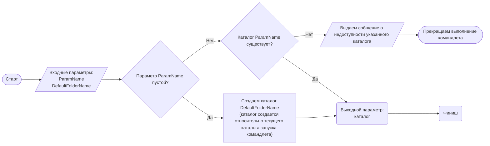

## Проверка каталога - CheckFolder.ps1

```mermaid
flowchart LR
    Start([Старт])
    InputParam[/"Входные параметры:
                ParamName
                DefaultFolderName"/]
    CheckParam{Параметр ParamName пустой?}
    CheckFolder{Каталог ParamName существует?}
    Message[/Выдаем собщение о недоступности указанного каталога/]
    CreateFolder["Создаем каталог DefaultFolderName<br>(каталог создается относительно текущего каталога запуска командлета)"]
    Result(Выходной параметр:<br>каталог)
    Terminate([Прекращаем выполнение командлета])
    Finish(Финиш)

    Start --> InputParam
    InputParam --> CheckParam
        CheckParam --> |Нет| CheckFolder
            CheckFolder --> |Нет| Message
                Message --> Terminate
            CheckFolder --> |Да| Result
        CheckParam --> |Да| CreateFolder
            CreateFolder --> Result
    Result --> Finish
```
