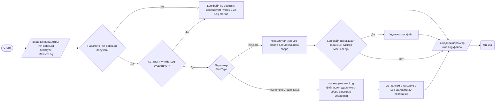

## Проверка возможности ведения Log файла - CheckLogFile.ps1

```mermaid
flowchart LR
    Start([Старт<brCheckLogFile.ps1>])
    InputParam[/"Входные параметры:
                InvFolderLog
                StartType
                MaxLenLog"/]
    CheckParamInvFolderLog{Параметр InvFolderLog получен?}
    CheckFolder{Каталог InvFolderLog существует?}
    NotLog[Log файл не ведется: формируем пустое имя Log файла]
    StartType{"Параметр
               StartType"}
    SetLogFileNameLocal[Формируем имя Log файла для локального сбора]
    SetLogFileNameRemote[Формируем имя Log файла для удаленного сбора и режима обработки]
    DeleteLog[Удаляем лог файл]
    СheckLogSize{Log файл превышает заданный размер MaxLenLog?}
    DeleteOldLog[Оставляем в каталоге с Log файлами 20 последних]
    Result[/"Выходной параметр:<br>имя Log файла"/]
    Finish(Финиш)

    Start --> InputParam
    InputParam --> CheckParamInvFolderLog
    CheckParamInvFolderLog --> |Нет| NotLog
    CheckParamInvFolderLog --> |Да| CheckFolder
        CheckFolder --> |Нет| NotLog
        CheckFolder --> |Да| StartType
            StartType --> |InvLocal| SetLogFileNameLocal
                SetLogFileNameLocal --> СheckLogSize
                    СheckLogSize --> |Да| DeleteLog
                    СheckLogSize --> |Нет| Result
            StartType --> |"InvRemote|CreateResult"| SetLogFileNameRemote
                SetLogFileNameRemote --> DeleteOldLog
    NotLog --> Result
    DeleteLog --> Result
    DeleteOldLog --> Result
    Result --> Finish

```

**Ссылки:**
- ["Описание входных параметров ../README.md"](../../README.md#параметры-запуска-командлета)
