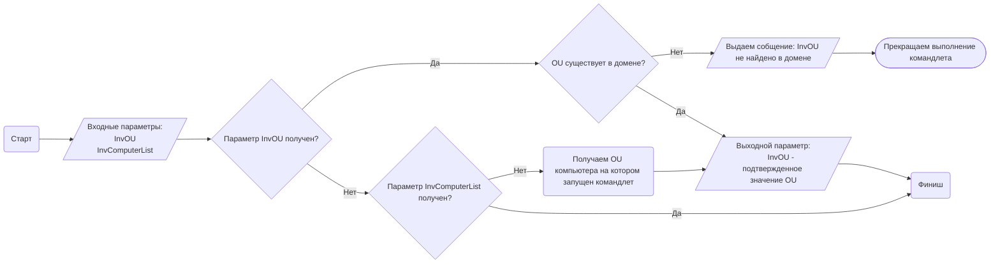

## Проверка параметра InvOU - CheckOU.ps1

```mermaid
flowchart LR
    Start(Старт)
    InputParam[/"Входные параметры:
                InvOU
                InvComputerList"/]
    CheckOU{Параметр InvOU получен?}
    Terminate([Прекращаем выполнение командлета])
    CheckExistOU{OU существует в домене?}
    CheckInvComputerList{Параметр InvComputerList получен?}
    GetCurrentOU(Получаем OU компьютера на котором запущен командлет)
    Message[/Выдаем собщение: InvOU не найдено в домене/]
    SetOU[/Выходной параметр:
        InvOU - подтвержденное значение OU/]
    Finish(Финиш)

    Start --> InputParam
    InputParam --> CheckOU
    CheckOU --> |Да| CheckExistOU
        CheckExistOU --> |Нет| Message
            Message --> Terminate
            CheckExistOU --> |Да| SetOU
    CheckOU --> |Нет| CheckInvComputerList
        CheckInvComputerList --> |Нет| GetCurrentOU
            GetCurrentOU --> SetOU
        CheckInvComputerList --> |Да| Finish
    SetOU --> Finish
```
