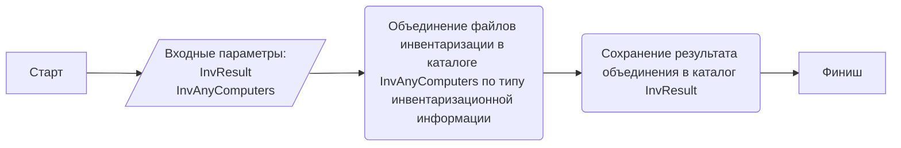

## Процедура объединения файлов - CreateResult.ps1

```mermaid
flowchart LR
    Start[Старт]
    InputParam[/Входные параметры:
               InvResult
               InvAnyComputers/]
    Create(Объединение файлов инвентаризации в каталоге InvAnyComputers по типу инвентаризационной информации)
    Save(Сохранение результата объединения в каталог InvResult)
    Finish[Финиш]

    Start --> InputParam
    InputParam --> Create
    Create --> Save
    Save --> Finish

```

**Ссылки:**
- [Описание входных параметров ../README.md](../README.md#параметры-запуска-командлета)
