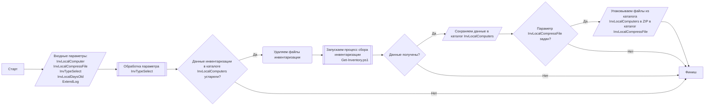

## Локальный сбор - InvLocal.ps1

**Ссылки:**
- [Обработка параметра InvTypeSelect - SelectInvType.ps1](SelectInvType.md)
- [Описание входных параметров ../README.md](../../README.md#параметры-запуска-командлета)
