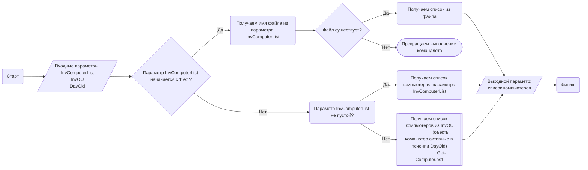

## Получаем список компьютеров - ListComputers.ps1

```mermaid
flowchart LR
    Start(Старт)
    InputParam[/"Входные параметры:
                InvComputerList
                InvOU
                DayOld"/]
    IfFile{"Параметр InvComputerList начинается с 'file:' ?"}
    IfNoEmpty("Параметр InvComputerList не пустой?")
    GetFileName(Получаем имя файла из параметра InvComputerList)
    GetListFromFile(Получаем список из файла)
    CheckFile{Файл существует?}
    Terminate([Прекращаем выполнение командлета])
    GetListFromParam(Получаем список компьютер из параметра InvComputerList)
    GetListFromOU[["Получаем список компьютеров из InvOU
                   (оъекты компьютер активные в течении DayOld)
                   Get-Computer.ps1"]]
    Result[/"Выходной параметр:
            список компьютеров"/]
    Finish(Финиш)

    Start --> InputParam
    InputParam --> IfFile
    IfFile --> |Да| GetFileName
        GetFileName --> CheckFile
            CheckFile --> |Да| GetListFromFile
                GetListFromFile --> Result
            CheckFile --> |Нет| Terminate
    IfFile --> |Нет| IfNoEmpty
        IfNoEmpty --> |Да| GetListFromParam
            GetListFromParam --> Result
        IfNoEmpty --> |Нет| GetListFromOU
            GetListFromOU --> Result

    Result --> Finish
```

