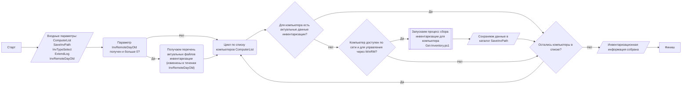

## Опрашиваем компьютеры - PollComputers.ps1

```mermaid
flowchart LR
    Start[Старт]
    InputParam[/"Входные параметры:
                ComputerList
                SaveInvPath
                InvTypeSelect
                ExtendLog
                InvRemoteDayOld"/]
    IfInvRemoteDayOld(Параметр InvRemoteDayOld получен и больше 0?)
    GetFilesInventory("Получаем перечень актуальных файлов инвентаризации (изменены в течении InvRemoteDayOld)")

    StartLoop(Цикл по списку компьютеров ComputerList)
    If{Остались компьютеры в списке?}
    CheckActualInv{Для компьютера есть актуальные данные инвентаризации?}
    СheckComputer{Компьютер доступен по сети и для управления через WinRM?}
    StartInv[["Запускаем процесс сбора инвентаризации для компьютера
                Get-Inventory.ps1"]]
    SaveInv[/Сохраняем данные в каталог SaveInvPath/]

    Result[/Инвентаризационная информация собрана/]
    Finish[Финиш]

    Start --> InputParam
    InputParam --> IfInvRemoteDayOld
    IfInvRemoteDayOld --> |Да| GetFilesInventory
    IfInvRemoteDayOld --> |Нет| StartLoop
    GetFilesInventory --> StartLoop
    StartLoop --> CheckActualInv
        CheckActualInv --> |Да| If 
        CheckActualInv --> |Нет| СheckComputer
            СheckComputer --> |Да| StartInv
                StartInv --> SaveInv
                SaveInv --> If
            СheckComputer --> |Нет| If
    If --> |Да| StartLoop
    If --> |Нет| Result
    Result --> Finish

```
