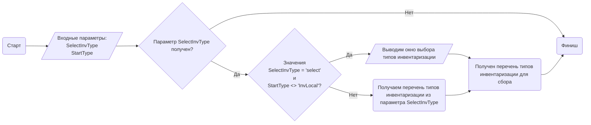

## Обработка параметра InvTypeSelect - SelectInvType.ps1

```mermaid
flowchart LR
    Start(Старт)
    InputParam[/"Входные параметры:
                SelectInvType
                StartType"/]
    Check{Параметр SelectInvType получен?}
    CheckSelect{"Значения
                 SelectInvType = 'select'
                 и
                 StartType <> 'InvLocal'?"}
    ShowSelect[/"Выводим окно выбора типов инвентаризации"/]
    GetListType(Получаем перечень типов инвентаризации из параметра SelectInvType)
    SetInvSelect(Получен перечень типов инвентаризации для сбора)
    Finish(Финиш)

    Start --> InputParam
    InputParam --> Check
    Check --> |Да| CheckSelect
        CheckSelect --> |Да| ShowSelect
            ShowSelect --> SetInvSelect
        CheckSelect --> |Нет| GetListType
            GetListType --> SetInvSelect
    Check --> |Нет| Finish
    SetInvSelect --> Finish

```
