## Удаленный сбор

```mermaid
flowchart LR
    Start[Старт]
    InputParam[/"Входные параметры:
                InvFolderAnyComputers
                InvTypeSelect
                InvComputerList
                InvOU
                InvFolderResult
                DayOld
                InvRemoteDayOld"/]
    CheckOUList{Параметры InvOU и InvComputerList заданы одновременно?}
    Message[/Выдаем собщение: параметры InvOU и InvComputerList взаимоисключающие/]
    Terminate([Прекращаем выполнение командлета])
    CheckInvFolderResult[["Проверка каталога  InvFolderResult
                            CheckFolder.ps1"]]    
    CheckOU[["Проверка параметра InvOU
            CheckOU.ps1"]]
    ListComputers[[Получаем список компьютеров - ListComputers.ps1]]
    PollComputers[[Опрашиваем компьютеры по полученному перечню - PollComputers.ps1]]
    Result[/Инвентаризационная информация собрана/]
    Finish[Финиш]

    Start --> InputParam
    InputParam --> CheckOUList
    CheckOUList --> |Да| Message
        Message --> Terminate
    CheckOUList --> |Нет| CheckInvFolderResult
    CheckInvFolderResult --> CheckOU
    CheckOU --> ListComputers
    ListComputers --> PollComputers
    PollComputers --> Result
    Result --> Finish
```

**Ссылки:**
- [Проверка каталога InvFolderResult - CheckFolder.ps1](CheckFolder.md)
- [Обработка параметра InvTypeSelect - SelectInvType.ps1](SelectInvType.md)
- [Проверка параметра InvOU - CheckOU.ps1](CheckOU.md)
- [Получаем список компьютеров - ListComputers.ps1](ListComputers.md)
- [Опрашиваем компьютеры по полученному перечню - PollComputers.ps1](PollComputers.md)
- [Описание входных параметров ../README.md](../../README.md#параметры-запуска-командлета)
