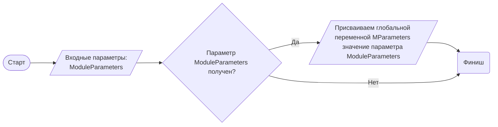

## Обработка дополнительных параметров модулей

```mermaid
flowchart LR
    Start([Старт])
    InputParam[/"Входные параметры:
                ModuleParameters"/]
    CheckParam{Параметр ModuleParameters получен?}
    SetMP[/Присваиваем глобальной переменной MParameters значение параметра ModuleParameters/]
    Finish(Финиш)

    Start --> InputParam
    InputParam --> CheckParam
    CheckParam --> |Да| SetMP
        SetMP --> Finish
    CheckParam --> |Нет| Finish
```

**Ссылки:**
- ["Описание входных параметров ../README.md"](../../README.md#параметры-запуска-командлета)
