## Процедура обработки

```mermaid
flowchart LR
    Start[Старт]
    InputParam[/"Входные параметры:
               InvResult
               InvAnyComputers
               InvZIPFiles
               DayToDelete
               SelectInvTypeArray
               InvOU"/]
    CheckInvResult[["Проверка каталога InvResult
                            CheckFolder.ps1"]]
    CheckOU{Параметр InvOU задан?}
    GetComputersOU[["Получаем перечень компьютеров из OU
                Get-Computer.ps1"]]
    ExportComputers(Экспортируем перечень компьютеров )
    CheckZIP{Параметр InvZIPFiles задан и каталог InvZIPFiles существует?}
    ExtractZIP[[Распаковка ZIP файлов из каталога InvZIPFiles в каталог InvAnyComputers
                UnZip.ps1]]
    DeleteOld[[Удаление файлов в каталоге InvAnyComputers старше DayToDelete дней
               DeleteOld.ps1]]
    CreateResult[[Запуск процедуры объединения файлов
                    CreateResult.ps1]]
    Finish[Финиш]

    Start --> InputParam
    InputParam --> CheckInvResult
    CheckInvResult --> CheckOU
    CheckOU --> |Да| GetComputersOU
        GetComputersOU --> ExportComputers
        ExportComputers --> CheckZIP
    CheckOU --> |Нет| CheckZIP
    CheckZIP --> |Да| ExtractZIP
        ExtractZIP --> DeleteOld
    CheckZIP --> |Нет| DeleteOld
    DeleteOld --> CreateResult
    CreateResult --> Finish

```

**Ссылки:**
- [Запуск процедуры объединения файлов - CreateResult.ps1](CreateResult.md)
- [Описание входных параметров ../README.md](../../README.md#параметры-запуска-командлета)
