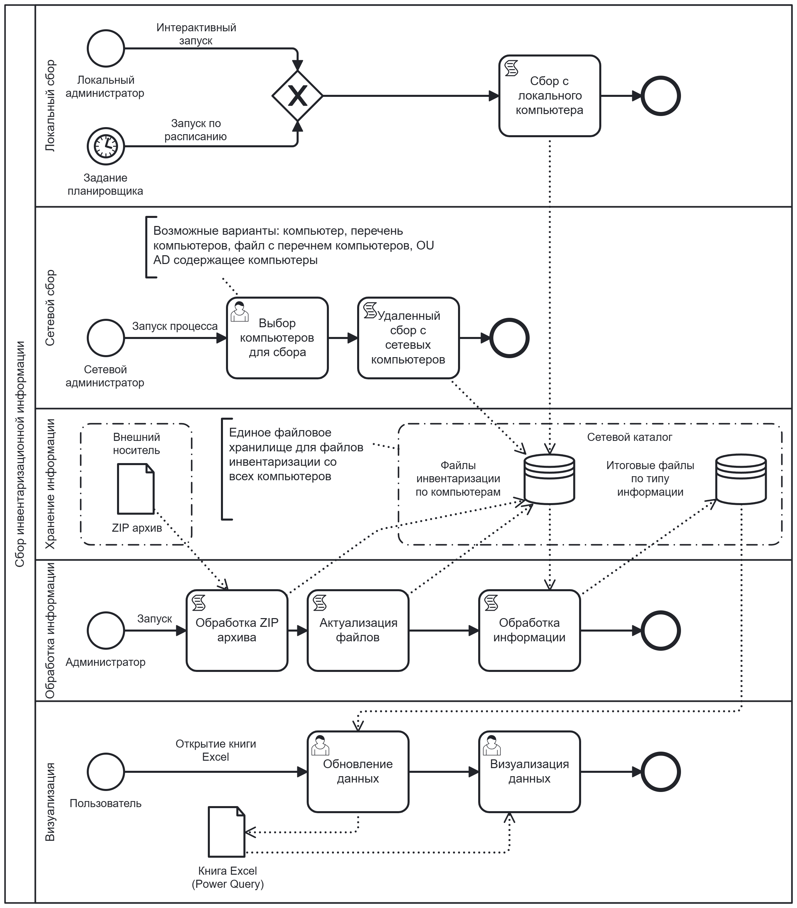

# Техническое задание на систему сбора инвентаризационной информации "Inventory"

## 1. Введение

### 1.1. Наименование проекта
Разработка программного модуля "Inventory" – решения для автоматизированного сбора инвентаризационной информации с компьютеров под управлением ОС Windows на базе PowerShell.

### 1.2. Цели создания
- **Автоматизация процессов инвентаризации:** Устранение ручного труда при сборе инвентаризационной информации об аппаратном и программном обеспечении, настройках ОС.
- **Обеспечение аудита и контроля:** Создание единого, актуального источника инвентаризационной информации для аудита лицензий ПО, проверки соответствия политикам безопасности, планирования модернизации.
- **Оптимизация процессов поддержки:** Предоставление ИТ-специалистам инструмента для оперативной диагностики конфигурации удаленных и локальных компьютеров.
- **Создание основы для анализа:** Формирование структурированного хранилища инвентаризационной информации для последующего анализа средствами BI (Excel Power Query).

### 1.3. Область применения
- **Регулярная инвентаризация IT-активов** в организациях с парком компьютеров под управлением Windows.
- **Аудит лицензионного программного обеспечения.**
- **Мониторинг состояния оборудования.**
- **Сбор информации для подготовки требований** к закупкам и модернизации.
- **Диагностика проблем** технической поддержкой.

### 1.4. Состав работ
Настоящим ТЗ описывается текущее состояние системы для целей:
1. Формализации требований к эксплуатируемой системе.
2. Создания базы для планирования дальнейших доработок и поддержки.
3. Установки четких критериев приемки при передаче на сопровождение.

## 2. Термины и определения

| Термин | Определение |
|--------|-------------|
| Инвентаризационная информация | Информация об аппаратном обеспечении, установленном ПО, настройках ОС и системе, собираемые с компьютера |
| Модуль сбора | Отдельный скрипт PowerShell (`.ps1` файл), ответственный за сбор одного конкретного типа ИИ (например, `hwr.ps1`) |
| Командлет | Основная выполняемая единица в PowerShell. В контексте системы – `Start-Inventory` |
| OU (Organizational Unit) | Организационное подразделение в службе каталогов Active Directory, контейнер для объектов (компьютеров, пользователей) |
| AD | Active Directory, служба каталогов Microsoft |
| WinRM | Windows Remote Management (удаленное управление Windows) |
| DMZ | Demilitarized Zone (демилитаризованная зона) - изолированный сетевой сегмент, предназначенный для размещения общедоступных сервисов |
| WMI | Windows Management Instrumentation - инфраструктура управления системами Windows |

## 3. Общие требования к системе

### 3.1. Требования к окружению и платформе
-   **Целевые операционные системы:** Windows 10 и выше; Windows Server 2012 R2 и выше.
-   **Минимальная версия PowerShell:** 3.0 (для удаленного сбора и работы с AD). Для локального сбора достаточно PowerShell 2.0.
-   **Необходимые компоненты:**
    -   Для удаленного сбора: служба WinRM на целевых компьютерах.
    -   Для получения списка компьютеров из AD: модуль PowerShell `ActiveDirectory` на компьютере-сборщике.
    -   Для визуализации: Microsoft Excel с поддержкой Power Query (рекомендуется 2016 и выше).
-   **Архитектура:** Файлово-ориентированная, без серверных компонентов и баз данных. Используется сетевой файловый ресурс в качестве центрального хранилища.

### 3.2. Архитектурные требования и ограничения
1.  **Гибридная модель сбора:** Система должна поддерживать **локальный** (запускаемый непосредственно на объекте сбора) и **удаленный** (запускаемый на компьютере-сборщике) сбор информации.
2.  **Консолидация в едином хранилище:** Вся информация, независимо от метода и источника сбора (домен, изолированный сегмент, автономный компьютер), должны накапливаться и обрабатываться в единой структуре каталогов. Все рабочие каталоги системы могут указывать на сетевые ресурсы (UNC-пути).
3.  **Поддержка изолированных сегментов (DMZ):** Для компьютеров без прямого сетевого доступа к центральному хранилищу должен быть предусмотрен сценарий **локального сбора с последующим ручным переносом** ZIP-архива.
4.  **Модульность:** Функциональность сбора каждого типа информации должна быть инкапсулирована в независимый, подключаемый модуль. Добавление нового типа инвентаризационной информации не должно требовать изменения ядра системы.
5.  **Идемпотентность:** Повторный запуск сбора с одних и тех же источников не должен приводить к дублированию информации в конечных результатах.

#### 3.2.1 Преимущества архитектуры
1. **Безопасность**: Изолированные сегменты не требуют постоянного сетевого доступа к основному серверу
2. **Гибкость**: Поддержка различных сценариев сбора информации
3. **Масштабируемость**: Возможность постепенного добавления новых источников сбора и сбора новых типов информации
4. **Простота развертывания**: Не требует установки серверных компонентов или настройки баз данных
5. **Совместимость**: Единый формат информации для всех методов сбора

## 4. Функциональные требования

### 4.1. Основные функции системы

| ID | Наименование | Описание требования | Компонент реализации / Параметр |
| :--- | :--- | :--- | :--- |
| **FR-01** | Управление сбором через единый интерфейс | Весь функционал системы должен быть доступен через основной командлет `Start-Inventory`. | `Start-Inventory.psm1` |
| **FR-02** | Локальный сбор инвентаризационной информации | Сбор инвентаризационной информации непосредственно на компьютере, где запущен сбор, с сохранением информации в локальный или сетевой каталог | `-StartType InvLocal` |
| <nobr>**FR-02.1** | Упаковка инвентаризационной информации в ZIP-архив | При локальном сборе результаты могут быть упакованы в ZIP-архив | `-InvFolderZIPFiles` |
| **FR-03** | Удаленный сбор инвентаризационной информации | Сбор инвентаризационной информации с группы компьютеров, подключенных к сети, с использованием WinRM. С возможностью управлением источниками сбора | `-StartType InvRemote` |
| <nobr>**FR-03.1** | Управление источниками сбора инвентаризационной информации | Должна быть возможность вариантов выбора компьютеров с которых будет выполнен сбор  | `-InvOU`, `-InvComputerList` |
| <nobr>**FR-03.1.1** | Получение списка из OU | Получение списка компьютеров из заданного OU домена | `-InvOU "OU=...,DC=..."` |
| <nobr>**FR-03.1.2** | Перечисление имен компьютеров параметром  | Получение списка компьютеров через параметр командлета | `-InvComputerList "Computer1", "Computer2"` |
| <nobr>**FR-03.1.3** | Чтение списка компьютеров из файла | Получение списка компьютеров из CSV файла с заголовком `ComputerName` | `-InvComputerList "file:Computers.csv"` |
| **FR-04** | Выбор типов собираемой информации | Должна быть возможность выбора типов собираемой инвентаризационной информации | `-SelectInvType` |
| **FR-04.1** | Интерактивный выбор типов через консоль | Командлет выдает перечень типов информации с возможностью выбора пользователем | `-SelectInvType select` |
| **FR-04.2** | Указание конкретных типов | Указание конкретных типов через параметр командлета (например, ПО ("swr") и обновления ОС ("hfx")) | `-SelectInvType "swr", "hfx"` |
| **FR-05** | Консолидация и обработка информации | Объединение файлов от отдельных компьютеров в итоговые файлы по типам информации, удаление устаревших файлов | `-StartType CreateResult`, `-DayOld` |
| <nobr>**FR-05.1** | Обработка ZIP архивов локального сбора | Автоматическое распаковка ZIP-архивов, помещенных в каталог `InvFolderZIPFiles`, и включение информации из них в процесс консолидации | (часть `CreateResult`) |
| **FR-06** | Расширяемость (добавление модулей) | Архитектура должна позволять добавлять новые типы собираемой информации путем создания файла модуля по стандарту, без изменения ядра системы | Каталог `Get-Inventory-Module\` |

## 5. Нефункциональные требования

| ID | Категория | Требование | Критерий приемки / Метрика |
| :--- | :--- | :--- | :--- |
| <nobr>**NFR-01** | **Производительность** | Минимальное влияние на производительность целевых систем при сборе инвентаризационной информации | Время сбора ≤ 5 минут на компьютере средней мощности (4 ядра CPU, 8 ГБ RAM) |
| <nobr>**NFR-02** | **Производительность** | Система должна поддерживать механизм оптимизации производительности через проверку актуальности уже собранной информации | Если для компьютера уже существуют файлы инвентаризационной информации и их возраст меньше указанного значения (используется параметр, указывающий максимальный допустимый возраст файлов инвентаризационной информации в днях), сбор с этого компьютера пропускается. При этом значение параметра по умолчанию обеспечивает выполнение сбора без проверки актуальности |
| <nobr>**NFR-03** | **Надежность** | Устойчивость к ошибкам на отдельных целевых компьютерах | При недоступности или ошибке на одном компьютере сбор продолжается для остальных, ошибка логируется |
| <nobr>**NFR-04** | **Надежность** | Предварительная проверка наличия необходимых прав доступа при удаленном сборе | Перед началом сбора с удаленного компьютера система проверяет наличие административных прав у используемой учетной записи. При отсутствии необходимых прав система логирует ошибку и пропускает данный компьютер |
| <nobr>**NFR-05** | **Надежность** | Предварительная проверка доступности компьютеров в сети | Перед началом сбора система проверяет сетевую доступность компьютера и доступность механизма удаленного управления. Для недоступных компьютеров сбор пропускается, система логирует ошибку и пропускает данный компьютер |
| <nobr>**NFR-06** | **Надежность** | Автоматическая проверка и создание требуемых рабочих каталогов | При запуске система проверяет наличие всех необходимых рабочих каталогов. В случае отсутствия каталогов система автоматически их создает |
| <nobr>**NFR-07** | **Надежность** | Автоматическая самоконфигурация при определенных условиях | При запуске удаленного сбора без явного указания источников, если компьютер включен в домен Active Directory, система автоматически определяет контекст для сбора - OU компьютера на котором запущен сбор |
| <nobr>**NFR-08** | **Надежность** | Ведение операционного лога | Система ведет структурированный лог-файл в каталоге `InvFolderLog`. |
| <nobr>**NFR-08.1** | **Надежность** | Ротация лог файлов процедур удаленного сбора и консолидации информации | Логи ведутся в отдельных файлах по дате выполнения. Старые файлы удаляются, система обеспечивает хранение не более 20 лог файлов |
| <nobr>**NFR-08.2** | **Надежность** | Ротация лог файлов локального сбора | Логи ведутся в файле по имени компьютера. Система обеспечивает контроль размера файла не более 20Кб, после превышения размера файл пересоздается |
| <nobr>**NFR-09** | **Безопасность** | Контроль доступа к информации | Права NTFS на каталогах с инвентаризационной информацией должны следовать принципу наименьших привилегий. |
| <nobr>**NFR-10** | **Удобство использования** | Наличие встроенной справки | Полноценная справка доступна через `Get-Help Start-Inventory -Full`, включая описания параметров и примеры |
| <nobr>**NFR-11** | **Портативность** | Отсутствие жесткой привязки к окружению | Система не требует установки в GAC (Global Assembly Cache, Глобальный кэш сборок), регистрации в системе. Развертывание — копирование файлов |


## 6. Пользовательские истории (User Stories)

---

**US-01**: Как системный администратор, я хочу собрать инвентаризационную информацию обо всех компьютерах в моем домене, чтобы иметь актуальную информацию об оборудовании и ПО.

   **Критерии приемки:**
      - Система собирает все типы инвентаризационной информации со всех компьютеров в указанном OU домена
      - Результаты консолидируются в файлы по типам информации, доступные для анализа в Excel
    
```yaml
# US-01: Сбор инвентаризационной информации c компьютеров включенных в домен
id: "US-01"
title: "Сбор инвентаризационной информации c компьютеров включенных в домен"
role: "системный администратор"
goal: "собрать инвентаризационную информацию обо всех компьютерах в моем домене"
benefit: "иметь актуальную инвентаризацию оборудования и ПО"
context: |
  В организации с парком 200+ компьютеров ручной сбор инвентаризационной информации невозможен.
  Требуется автоматизированный процесс получения информации.
acceptance_criteria:
  - "Система собирает все типы инвентаризационной информации со всех компьютеров в указанном OU домена"
  - "Результаты консолидируются в файлы по типам информации, доступные для анализа в Excel"
priority: "high"
implementation_complexity: "medium"
linked_requirements: ["FR-03", "FR-03.1", "FR-03.1.1", "FR-05"]
test_scenario: |
  1. Выполнить команду:
     `Start-Inventory -StartType InvRemoteCreateResult -InvOU "OU=Computers,DC=company,DC=local" -InvFolderAnyComputers \\fileserver\inventory\InvAnyComputers -InvFolderResult \\fileserver\inventory\InvResult`
  2. Дождаться выполнения процедуры сбора
  3. Проверить наличие файлов по компьютерам в каталоге \\fileserver\inventory\InvAnyComputers
  4. Проверить наличие консолидированных файлов (в количестве 19) в каталоге \\fileserver\inventory\Results
  5. Открыть файл inv.xlsm, выполнить обновление информации, убедиться в наличии информации
```

----

**US-02**: Как системный администратор, я хочу собрать инвентаризационную информацию с автономного компьютера, чтобы иметь актуальную информацию об оборудовании и ПО.

   **Критерии приемки:**
     - Скрипты системы расположены в локальном каталоге из которого осуществляется запуск
     - Система собирает все типы инвентаризационной информации с автономного компьютера
     - Собранная информация размещается в локальном каталоге
     - Файлы с инвентаризационной информацией для ручного переноса помещаются в ZIP-архивов

```yaml
# US-02: Сбор информации с отдельного компьютера
id: "US-02"
title: "Сбор информации с отдельного компьютера"
role: "системный администратор"
goal: "собрать информацию только с отдельного компьютера"
benefit: "иметь актуальную инвентаризацию оборудования и ПО"
context: |
    Автономный компьютер не имеет доступ во внутреннюю сеть.
    Процесс сбора запускается непосредственно на компьютере.
acceptance_criteria:
  - "Скрипты системы расположены в локальном каталоге из которого осуществляется запуск"
  - "Система собирает все типы инвентаризационной информации с автономного компьютера"
  - "Собранная информация размещается в локальном каталоге"
  - "Файлы с инвентаризационной информацией для ручного переноса помещаются в ZIP-архивов"
priority: "medium"
implementation_complexity: "medium"
linked_requirements: ["FR-02", "FR-02.1"]
test_scenario: |
    1. На автономно компьютере скопировать скрипты системы в каталог C:\Inventory
    2. Выполнить команду:
       'Start-Inventory -StartType InvLocal -InvFolderAnyComputers C:\Inventory\InvAnyComputers -InvFolderZIPFiles C:\Inventory\ZIP`
    3. Проверить формирование файлов в каталоге C:\Inventory\InvAnyComputers
    4. Проверить формирование ZIP файла в каталоге C:\Inventory\ZIP
```

---

**US-03**: Как системный администратор, я хочу выбрать только определенные типы инвентаризационной информации, чтобы сократить время сбора и объем инвентаризационной информации.

   **Критерии приемки:**
     - Система поддерживает выбор конкретных типов информации через параметр командлета
     - Имеется интерактивный режим выбора типов
     - Возможность указания списка типов через параметр
     - При выборе подмножества типов собирается только указанная информация
     - Результаты консолидируются в файлы по типам информации, доступные для анализа в Excel
 
 ```yaml
# US-03: Выборочный сбор определенных типов информации
id: US-03
title: "Выборочный сбор типов информации"
role: "системный администратор"
goal: "собрать информацию только определенного типа с компьютеров в моем домене"
benefit: "сократить время сбора и объем инвентаризационной информации"
context: |
  Для решения конкретных задач не требуется полный сбор всех 19 типов информации.
  Необходима возможность выбора только нужных типов информации.
acceptance_criteria:
    - "Система поддерживает выбор конкретных типов информации через параметр командлета"
    - "Имеется интерактивный режим выбора типов"
    - "Возможность указания списка типов через параметр"
    - "При выборе подмножества типов собирается только указанная информация"
    - "Результаты консолидируются в файлы по типам информации, доступные для анализа в Excel"
priority: "medium"
implementation_complexity: "medium"
linked_requirements: ["FR-03", "FR-03.1", "FR-03.1.1", "FR-04", "FR-04.1", "FR-04.2", "FR-05"]
test_scenario: |
    1. Выполнить команду:
        `Start-Inventory -StartType InvRemoteCreateResult -InvOU "OU=Computers,DC=company,DC=local" -SelectInvType hwr,swr,net -InvFolderAnyComputers \\fileserver\inventory\InvAnyComputers -InvFolderResult \\fileserver\inventory\InvResult`
    2. Дождаться выполнения процедуры сбора
    3. Проверить создание в каталоге \\fileserver\inventory\InvResult только файлов: hwr.csv, swr.csv, net.csv
    4. Убедиться, что другие типы информации не собраны
    5. Выполнить команду:
        `Start-Inventory -StartType InvRemoteCreateResult -InvOU "OU=Computers,DC=company,DC=local" -SelectInvType select -InvFolderAnyComputers \\fileserver\inventory\InvAnyComputers -InvFolderResult \\fileserver\inventory\InvResult`
    6. Убедится в возможности интерактивного выбора типов инвентаризационной информации
    7. Выбрать тип Логические диски (dsk)
    8. Дождаться выполнения процедуры сбора
    9. Проверить создание в каталоге \\fileserver\inventory\InvAnyComputers файла: dsk.csv
```

---

**US-04**: Как IT-менеджер, я хочу получить полную инвентаризационную информацию, актуальностью 60 дней, собранную с сетевых и автономных компьютеров, чтобы провести анализ использования дискового пространства на компьютерах.
  **Критерии приемки:**
     - Инвентаризационная информация предварительно собрана системным администратором с сетевых и автономных компьютеров и размещена в соответствующих каталогах
     - Система обрабатывает ZIP архивы файлами полученными с автономных компьютеров
     - Система удаляет файлы с инвентаризационной информацией старше 30 дней
     - Информация с сетевых и автономных компьютеров консолидируются
     - Возможность идентификации компьютеров с недостатком места

```yaml
# US-04: Объединение инвентаризационной информации для анализа
id: "US-04"
title: "Объединение инвентаризационной информации для анализа"
role: "IT-менеджер"
goal: "анализировать использование дискового пространства на сетевых и автономных компьютерах на основе инвентаризационной информации"
benefit: "оптимизировать хранение информации"
context: |
    На серверах и рабочих станциях заканчивается свободное дисковое пространство.
    Требуется выявить компьютеры с критически малым свободным местом.
acceptance_criteria:
     - "Инвентаризационная информация предварительно собрана системным администратором с сетевых и автономных компьютеров и размещена в соответствующих каталогах"
     - "Система обрабатывает ZIP архивы файлами полученными с автономных компьютеров"
     - "Система удаляет файлы с инвентаризационной информацией старше 60 дней"
     - "Информация с сетевых и автономных компьютеров консолидируются"
     - "Возможность идентификации компьютеров с недостатком места"
priority: "medium"
implementation_complexity: "medium"
linked_requirements: ["FR-05", "FR-05.1"]
test_scenario: |
    1. Выполнить команду:
    `Start-Inventory -StartType InvCreateResult -InvFolderAnyComputers \\fileserver\inventory\InvAnyComputers -InvFolderZIPFiles \\fileserver\inventory\ZIP -InvFolderResult \\fileserver\inventory\InvResult -DayOld 60`
    2. Проверить что в каталоге \\fileserver\inventory\InvAnyComputers нет файлов старше 60 дней
    3. Открыть Excel-отчет, выполнить обновление информации
    4. В Excel-отчете на листе 'dsk' отсортировать по полю FreeSpace
```

---

**US-05**: Как системный администратор, я хочу использовать разные методы сбора для разных сегментов сети (удаленный сбор для доверенного сегмента, локальный сбор для DMZ) из соображений безопасности.

   **Критерии приемки:**
     - Для DMZ: локальный сбор + ручной перенос ZIP-архивов
     - Для внутренней сети: удаленный сбор через WinRM
     - Единый формат информации для обоих методов
     - Автоматическое объединение информации при обработке

```yaml
# US-05: Использование разных методов сбора
id: "US-05"
title: "Использование разных методов сбора"
role: "системный администратор"
goal: "использовать разные методы сбора для разных сегментов сети"
benefit: "соблюдать политики безопасности для DMZ и изолированных сетей"
context: |
    Компьютеры в DMZ имеют ограниченный доступ во внутреннюю сеть.
    Прямой удаленный сбор через WinRM из внутренней сети невозможен.
acceptance_criteria:
    - "Для DMZ: локальный сбор + ручной перенос ZIP-архивов"
    - "Для внутренней сети: удаленный сбор через WinRM"
    - "Единый формат информации для обоих методов"
    - "Автоматическое объединение информации при обработке"
priority: "medium"
implementation_complexity: "medium"
linked_requirements: ["FR-02", "FR-02.1", "FR-03", "FR-03.1", "FR-03.1.1", "FR-05", "FR-05.1"]
test_scenario: |
    1. На компьютерах в DMZ настроить локальный сбор в ZIP
    2. Вручную скопировать архивы в \\fileserver\inventory\ZIP\
    3. Для внутренней сети выполнить удаленный сбор в каталог \\fileserver\inventory\InvAnyComputers
    4. Запустить CreateResult для объединения информации
    `Start-Inventory -StartType InvCreateResult -InvFolderAnyComputers \\fileserver\inventory\InvAnyComputers -InvFolderResult \\fileserver\inventory\InvResult`
```

**US-6**: Как системный администратор, я хочу получать инвентаризационную информацию с сетевых компьютеров без использования удаленного сбора, для получения информации с компьютеров на которых отключена служба удаленного управления.

   **Критерии приемки:**
      - На компьютере создано задание в системном планировщике для запуска локального сбора в сетевой каталог
      - Скрипты системы расположены в сетевом каталоге из которого осуществляется запуск
      - Собранная информация размещается в сетевом каталоге

```yaml
# US-06: Ассинхронный сбор с сетевых компьютеров
id: "US-06"
title: "Ассинхронный сбор с сетевых компьютеров"
role: "системный администратор"
goal: "использовать локальный сбор для сетевых компьютеров"
benefit: "получать инвентаризационную информацию с компьютеров с которых невозможно собрать информацию удаленно"
context: |
    На части компьютеров в организации не включена служба удаленного управления.
    На части компьютеров запрещен удаленный сбор и администратор не имеет административных прав на них. 
    Компьютеры в организации включаются в разное время или могут быть выключены в течении неопределенного периода, из-за чего удаленный сбор не всегда эффективен.
acceptance_criteria:
    - "На компьютере создано задание в системном планировщике для запуска локального сбора в сетевой каталог"
    - "Скрипты системы расположены в сетевом каталоге из которого осуществляется запуск"
    - "Собранная информация размещается в сетевом каталоге"
priority: "medium"
implementation_complexity: "medium"
linked_requirements: ["FR-02"]
test_scenario: |
    1. На компьютерах настроить задание планировщика с запуском из сетевого каталога \\fileserver\inventory\\Src и размещением файлов в \\fileserver\inventory\InvAnyComputers
    2. Дождаться выполнения задания планировщика
    3. Проверить появление файлов в каталоге \\fileserver\inventory\InvAnyComputers
```

---

## 7. Сценарии использования (Use Case)

### 7.1. Общие включаемые сценарии (Include)

*Вспомогательные сценарии, выполняющие проверки и подготовительные действия*

*Примечание: Альтернативные потоки, связанные с общесистемными механизмами (проверка доступности, прав, актуальности информации, создание каталогов), описаны в соответствующих включаемых сценариях (UC-INC-01 — UC-INC-04) и не дублируются в каждом основном Use Case. В основных сценариях приводятся только уникальные альтернативы, специфичные для данного потока.*

---

**UC-INC-01: Проверка и подготовка инфраструктуры**

- **Актор:** Система
- **Описание:** Базовые проверки перед началом любой операции сбора или обработки информации
- **Включается в:** Все основные Use Cases
- **Основной поток:**
    1. Система проверяет наличие всех обязательных каталогов, указанных в параметрах командлета:
        - Если параметры `InvFolderResult` или `InvFolderAnyComputers` не указаны, система создает требуемые каталоги в каталоге запуска скрипта (согласно NFR-06)
        - Если каталоги `InvFolderResult` или `InvFolderAnyComputers` недоступны, генерируется исключение
    2. Система проверяет наличие каталога размещения лог-файлов:
        - Если параметр `InvFolderLog` не указан, лог-файл не ведется
        - Если каталог `InvFolderLog` недоступен, лог-файл не ведется
    3. Система выполняет ротацию лог-файлов (согласно NFR-08.1, NFR-08.2):
        - Для удаленного сбора/консолидации: оставляет не более 20 последних файлов
        - Для локального сбора: контролирует размер файла (не более 20Кб)

---

**UC-INC-02: Проверка актуальности информации**

- **Актор:** Система
- **Описание:** Проверка, требуется ли выполнять сбор для конкретного компьютера на основе возраста существующей информации
- **Включается в:** UC-01, UC-02, UC-03, UC-06
- **Предусловие:** Задан параметр `DayOld` для локального сбора и `InvRemoteDayOld` для удаленного сбора
- **Основной поток:**
    1. Система проверяет наличие в каталоге `InvFolderAnyComputers` файлов для данного компьютера по шаблону `ИмяКомпьютера.*.csv`
    2. Если файлы существуют:
        - Определяется дата самого свежего файла
        - Вычисляется разница в днях между текущей датой и датой файла
        - Если разница меньше или равна `DayOld` для локального сбора, или `InvRemoteDayOld` для удаленного сбора, система пропускает сбор для этого компьютера (логирует пропуск)
    3. Если файлы не существуют или их возраст превышает `DayOld`|`InvRemoteDayOld`, сбор выполняется
- **Альтернативный поток:**
    - Если параметры `DayOld` или `InvRemoteDayOld` не указан (NFR-02):
        - Проверка пропускается, сбор выполняется для всех компьютеров

---

**UC-INC-03: Получение перечня компьютеров**

- **Актор:** Система
- **Описание:** Проверка корректности и непротиворечивости параметров (определяющих список целевых компьютеров), получение списка компьютеров
- **Включается в:** UC-01, UC-03, UC-05
- **Основной поток:**
    1. Система проверяет одновременное указание взаимоисключающих параметров (`InvOU` и `InvComputerList`)
       - Если указаны оба - выводится сообщение, выполнение прекращается
    2. Если `InvComputerList` начинается с префикс `file:`
       - Система проверяет наличие указанного файла
       - Если файл существует - система получает перечень компьютеров из файла
       - Если файл не существует - система выдает сообщение и прекращает выполнение
    3. Если `InvComputerList` не пустой
       - Система получает перечень компьютеров из значений параметра `InvComputerList`
    4. Если `InvOU` задан
       - Система проверяет наличие модуля ActiveDirectory
           - Если модуль отсутствует - выводится сообщение с инструкцией по установке, выполнение прекращается
           - Если модуль существует - система проверяет наличие `InvOU` в домене
           - Если OU не существует - система выдает сообщение и прекращает выполнение
    5. Если `InvOU` не задан
       - Система определяет текущее OU компьютера, на котором запущен процесс и использует его в качестве значения `InvOU` (NFR-07)
       - Выводит информационное сообщение об использовании текущего OU
    6. Система получает перечень компьютер в `InvOU` (если параметр `DayOld` задан, получает только компьютеры активные в течении `DayOld` дней)
    7. Формируется итоговый список компьютеров для обработки

---

**UC-INC-04: Проверка доступности компьютера**

- **Актор:** Система
- **Описание:** Проверка возможности удаленного подключения к целевому компьютеру
- **Включается в:** UC-01, UC-03, UC-05
- **Предусловие:** Получен список компьютеров для обработки
- **Основной поток (для каждого компьютера в списке):**
    1. Система проверяет сетевую доступность компьютера (Test-Connection)
        - Если компьютер недоступен — логируется ошибка, компьютер пропускается (NFR-05)
    2. Система проверяет доступность службы WinRM (Test-WSMan)
        - Если служба недоступна — логируется ошибка, компьютер пропускается (NFR-05)
    3. Система проверяет наличие административных прав на целевом компьютере
        - Если прав недостаточно — логируется ошибка, компьютер пропускается (NFR-04)
    4. Если все проверки пройдены, устанавливается CIM-сессия для сбора информации


**UC-INC-05: Валидация типов собираемой информации**
- **Актор:** Система
- **Описание:** Проверка корректности параметров, определяющих список типов собираемой информации, получение списка типов собираемой информации
- **Включается в:** UC-01, UC-02, UC-03, UC-05
- **Основной поток:**
    1. Система валидирует переданные типы информации в параметре `SelectInvType`:
        - Каждый тип проверяется на наличие соответствующего модуля в каталоге `Get-Inventory-Module\`
        - Если тип не является корректным, выводится предупреждение, тип исключается из сбора
- **Альтернативные потоки:**
    1. **Интерактивный выбор типов:**
        - При значении параметра `SelectInvType select` система выводит список всех доступных типов с возможностью множественного выбора
        - Пользователь выбирает требуемые типы
        - Если пользователь отказался от выбора (закрыл окно выбора), сбор прекращается
        - Выполняется сбор только выбранных типов
    2. Если после валидации типов список оказался пуст (все указанные типы некорректны) — сбор прекращается с сообщением об ошибке

---

### 7.2. Основные сценарии использования

**Акторы:**
- Системный администратор (Admin)
- IT-менеджер (Manager)
- Автоматизированная задача (Scheduled Task)

---

**UC-01: Удаленный сбор инвентаризационной информации со всего домена**

- **Актор:** Admin
- **Описание:** Полный цикл удаленного сбора и консолидации информации со всех компьютеров в заданном OU домена
- **Включает:** UC-INC-01, UC-INC-03, UC-INC-05. Для каждого компьютера: UC-INC-04. Для каждого компьютера, если указан DayOld или InvRemoteDayOld: UC-INC-02
- **Предусловие:** Наличие прав администратора на компьютерах в домене, доступ к сетевому каталогу для хранения информации
- **Основной поток:**
    1. Администратор запускает PowerShell под учетной записью с правами администратора на компьютерах в домене
    2. Выполняет командлет:
       ```powershell
       Start-Inventory -StartType InvRemoteCreateResult -InvOU "OU=Workstations,DC=company,DC=local" -InvFolderAnyComputers \\fileserver\inventory\InvAnyComputers -InvFolderResult \\fileserver\inventory\InvResult -InvFolderLog \\fileserver\inventory\Logs -DayOld 60 -InvRemoteDayOld 5
       ```
    3. Система выполняет UC-INC-01 (Проверка и подготовка инфраструктуры)
    4. Система выполняет UC-INC-05 (Валидация типов собираемой информации), получая список типов информации
    5. Система выполняет UC-INC-03 (Получение перечня компьютеров), получая список компьютеров из указанного OU
    6. Для каждого компьютера из полученного списка:
        - Если указан параметр `InvRemoteDayOld`, система выполняет UC-INC-02 (Проверка актуальности информации)
        - Если требуется сбор (информация устарела или отсутствует), система выполняет UC-INC-04 (Проверка доступности компьютера)
        - Если компьютер доступен:
            - Для каждого типа информации из полученного списка типов:
                * Загружается соответствующий модуль из каталога `Get-Inventory-Module\`
                * Выполняется удаленный сбор инвентаризационной информации через установленную CIM-сессию
                * Результат сохраняется в файл формата `ИмяКомпьютера.КодТипа.csv` в каталоге `InvFolderAnyComputers`
            - При ошибке в одном модуле сбор продолжается для остальных, ошибка логируется
    7. После завершения сбора со всех доступных компьютеров запускается процедура консолидации:
        - Если указан параметр `DayOld`, в каталоге `InvFolderAnyComputers` удаляются файлы инвентаризации старше указанного количества дней
        - Система сканирует каталог `InvFolderAnyComputers` и группирует файлы по списку типов информации
        - Для каждого типа информации создается итоговый файл `Тип.csv` в каталоге `InvFolderResult`
- **Постусловие:** Инвентаризационная информация собрана и доступна для анализа в Excel-отчете `inv.xlsm`
- **Альтернативные потоки:**
    1. Если после завершения сбора не было собрано информации ни с одного компьютера (все недоступны или вся информация актуальны), система выводит предупреждение "Нет информации для консолидации" и завершает выполнение без создания итоговых файлов
- **Исключения:**
    1. Если учетная запись под которой запущен процесс не имеет административных прав на целевом компьютере, система выводит предупреждение и переходит к следующему компьютеру (NFR-04)
    2. Если при выполнении сбора произошла критическая ошибка, делающая невозможным продолжение, процесс прерывается, частично собранная информация сохраняются

---

**UC-02: Локальный сбор инвентаризационной информации с автономного компьютера**

- **Актор:** Scheduled Task
- **Описание:** Сбор инвентаризационной информации непосредственно на компьютере с последующей упаковкой в ZIP-архив для ручного переноса
- **Включает:** UC-INC-01, UC-INC-05. UC-INC-02 (если указан DayOld)
- **Предусловие:** Настроенная задача в планировщике Windows, скрипты системы размещены в локальном или сетевом каталоге
- **Основной поток:**
    1. Планировщик задач запускает командный файл `InvLocal.cmd` от имени SYSTEM
    2. Выполняется PowerShell скрипт `InvLocal.ps1` с параметрами:
        - `StartType = "InvLocal"`
        - `InvFolderAnyComputers` (локальный путь для временного хранения)
        - `InvFolderZIPFiles` (путь для сохранения архивов)
        - `DayOld` (актуальность информации в днях)
        - `InvFolderLog` (путь для сохранения логов)
    3. Система выполняет UC-INC-01 (Проверка и подготовка инфраструктуры)
    4. Система выполняет UC-INC-05 (Валидация типов собираемой информации), получая список типов информации
    5. Если указан параметр `DayOld`, система выполняет UC-INC-02 (Проверка актуальности информации) для данного компьютера
    6. Если требуется сбор (информация устарела или отсутствует):
        - Для каждого типа информации из полученного списка типов:
            * Загружается соответствующий модуль из каталога `Get-Inventory-Module\`
            * Выполняется локальный сбор инвентаризационной информации
            * Результат сохраняется в файл формата `ИмяКомпьютера.КодТипа.csv` в каталоге `InvFolderAnyComputers`
        - При ошибке в одном модуле сбор продолжается для остальных, ошибка логируется
    7. Если указан параметр `InvFolderZIPFiles`:
        - Система упаковывает все собранные файлы в ZIP-архив с именем по шаблону: `inv.ИмяКомпьютера.zip`
        - ZIP-архив сохраняется в каталоге `InvFolderZIPFiles`
- **Постусловие:** ZIP-архив с инвентаризационной информацией готов для ручного переноса в центральное хранилище
- **Альтернативные потоки:**
    1. Если параметр `InvFolderZIPFiles` не указан, упаковка в архив не выполняется, информации остаются только в `InvFolderAnyComputers`

---

**UC-03: Выборочный сбор определенных типов инвентаризационной информации**

- **Актор:** Admin
- **Описание:** Сбор только указанных типов инвентаризационной информации с конкретных компьютеров для решения узких задач
- **Включает:** UC-INC-01, UC-INC-03, UC-INC-05. Для каждого компьютера: UC-INC-04. Для каждого компьютера, если указан DayOld: UC-INC-02
- **Предусловие:** Определены типы информации для сбора, доступ с правами администратора к целевым компьютерам
- **Основной поток:**
    1. Администратор запускает PowerShell
    2. Выполняет командлет с параметром выбора типов и указанием целевых компьютеров:
       ```powershell
       Start-Inventory -StartType InvRemote -SelectInvType hwr,swr,net -InvComputerList PC-01,PC-02 -InvFolderAnyComputers \\fileserver\inventory\InvAnyComputers
       ```
    3. Система выполняет UC-INC-01 (Проверка и подготовка инфраструктуры)
    4. Система выполняет UC-INC-05 (Валидация типов собираемой информации), получая список типов информации
    5. Система выполняет UC-INC-03 (Получение перечня компьютеров), получая список целевых компьютеров
    7. Для каждого компьютера из полученного списка:
        - Если указан параметр `InvRemoteDayOld`, система выполняет UC-INC-02 (Проверка актуальности информации) для данного компьютера
        - Если требуется сбор, система выполняет UC-INC-04 (Проверка доступности компьютера)
        - Если компьютер доступен:
            - Для каждого типа информации из списка типов:
                * Загружается соответствующий модуль
                * Выполняется удаленный сбор инвентаризационной информации через установленную CIM-сессию
                * Результат сохраняется в файл формата `ИмяКомпьютера.КодТипа.csv` в каталоге `InvFolderAnyComputers`
- **Постусловие:** Специализированная инвентаризационная информация собрана и готова для анализа
- **Исключения:** (аналогично UC-01)

---

**UC-04: Объединение инвентаризационной информации для анализа**

- **Актор:** Manager
- **Описание:** Обработка ранее собранной инвентаризационной информации, включая распаковку ZIP-архивов и консолидацию
- **Включает:** UC-INC-01
- **Предусловие:** Наличие собранной информации в каталоге `InvFolderAnyComputers` и/или ZIP-файлов в каталоге `InvFolderZIPFiles`
- **Основной поток:**
    1. Менеджер запускает процедуру обработки:
       ```powershell
       Start-Inventory -StartType CreateResult -DayOld 30 -InvFolderAnyComputers \\fileserver\inventory\InvAnyComputers -InvFolderZIPFiles \\fileserver\inventory\ZIP -InvFolderResult \\fileserver\inventory\InvResult
       ```
    2. Система выполняет UC-INC-01 (Проверка и подготовка инфраструктуры)
    3. Если указан параметр `InvFolderZIPFiles` и каталог существует:
        - Система сканирует каталог на наличие ZIP-файлов по шаблону `inv.*.zip`
        - Для каждого ZIP-файла:
            - Выполняется распаковка в каталог `InvFolderAnyComputers`
            - Если файл с таким именем уже существует, он перезаписывается
            - Если архив поврежден, система логирует ошибку и пропускает файл
    4. Запускается процедура консолидации информации:
        - Если указан параметр `DayOld`, в каталоге `InvFolderAnyComputers` удаляются файлы инвентаризации старше указанного количества дней
        - Система сканирует каталог `InvFolderAnyComputers` и группирует файлы по типу информации
        - Для каждого типа информации создается итоговый файл `Тип.csv` в каталоге `InvFolderResult` 
- **Постусловие:** Консолидированная инвентаризационная информация готова для импорта в Excel и анализа
- **Альтернативные потоки:**
    1. Если параметр `InvFolderZIPFiles` не указан или каталог не существует, этап распаковки пропускается
    2. Если после распаковки в `InvFolderAnyComputers` не обнаружено CSV-файлов, система выводит предупреждение и завершает выполнение
- **Исключения:**
    1. Каталог `InvFolderResult` недоступен для записи — выполнение прекращается

---

**UC-05: Гибридный сбор из разных доменов и сегментов сети**

- **Актор:** Admin
- **Описание:** Комбинирование инвентаризационной информации из различных источников (разные домены, DMZ, изолированные сети) в единую инвентаризационную базу
- **Включает:** UC-INC-01, UC-INC-05. UC-INC-03 (для каждого домена)
- **Предусловие:** Наличие компьютеров в разных доменах и сетевых сегментах, учетные данные для каждого домена
- **Основной поток:**
    1. **Сбор из основного домена:**
        - Администратор запускает PowerShell под учетной записью с правами в domain1
        - Выполняется командлет с параметрами для первого домена:
          ```powershell
          Start-Inventory -StartType InvRemote -InvOU "OU=Computers,DC=domain1,DC=local" -InvFolderAnyComputers \\fileserver\inventory\InvAnyComputers
          ```
        - Система выполняет UC-INC-01, UC-INC-03, UC-INC-05
        - Для каждого компьютера из OU domain1 выполняется сбор инвентаризационной информации (аналогично UC-01, шаг 6, без финальной консолидации)
    2. **Сбор из дополнительного домена:**
        - Администратор запускает PowerShell под учетной записью с правами в domain2
        - Выполняется аналогичный командлет для domain2 с указанием того же `InvFolderAnyComputers`
    3. **Сбор из DMZ/изолированного сегмента:**
        - На компьютерах в DMZ выполняется UC-02 (Локальный сбор) с упаковкой в ZIP
        - ZIP-архивы вручную переносятся в каталог `InvFolderZIPFiles` центрального хранилища
    4. **Финальная консолидация:**
        - Администратор запускает UC-04 (Объединение информации) для обработки всех источников
- **Постусловие:** Единая инвентаризационная информация по всем доменам и сегментам сети
- **Исключения:**
    1. Если учетная запись под которой запущен процесс не имеет административных прав на целевом компьютере, система выводит предупреждение и переходит к следующему компьютеру (NFR-04)
    2. При пересекающихся именах компьютеров в разных доменах файлы вида `ComputerName.Тип.csv` перезаписываются последним выполненным сбором
    3. Для избежания коллизий рекомендуется использовать суффикс домена в имени компьютера при сборе

---

**UC-06: Асинхронный сбор с сетевых компьютеров**

- **Актор:** Scheduled Task
- **Описание:** Локальный сбор с прямой записью в сетевой каталог для компьютеров, где удаленный сбор невозможен
- **Включает:** UC-INC-01, UC-INC-05. UC-INC-02 (если указан DayOld)
- **Предусловие:** Созданы сетевые каталоги `\\fileserver\inventory\InvAnyComputers` (запись) и `\\fileserver\inventory\Src` (чтение), настроены права доступа для учетных записей компьютеров
- **Основной поток:**
    1. Планировщик задач на целевом компьютере запускает командный файл `InvLocal.cmd` из сетевого каталога `\\fileserver\inventory\Src` от имени SYSTEM
    2. Выполняется PowerShell скрипт `InvLocal.ps1` с параметрами:
        - `StartType = "InvLocal"`
        - `InvFolderAnyComputers = \\fileserver\inventory\InvAnyComputers`
        - `DayOld = 5` (актуальность информации в днях)
    3. Система выполняет UC-INC-01 (Проверка и подготовка инфраструктуры) — проверяет доступность сетевых каталогов
    4. Система выполняет UC-INC-05 (Валидация типов собираемой информации), получая список типов информации
    5. Если указан параметр `DayOld`, система выполняет UC-INC-02 (Проверка актуальности информации) для данного компьютера
    6. Если требуется сбор (информация устарела или отсутствует):
        - Для каждого типа информации из списка типов информации:
            * Загружается соответствующий модуль из каталога `Get-Inventory-Module\` (из сетевого каталога)
            * Выполняется локальный сбор инвентаризационной информации
            * Результат сохраняется в файл формата `ИмяКомпьютера.КодТипа.csv` непосредственно в сетевой каталог `InvFolderAnyComputers`
- **Постусловие:** Инвентаризационная информация размещена в центральном хранилище и доступна для консолидации
- **Альтернативные потоки:**
- **Исключения:**
    1. Каталог `\\fileserver\inventory\Src` не существует или недоступен — задание планировщика не может быть выполнено
    2. Если компьютер не включен в домен, требуется предварительно проверить настройку доступа к каталогам `\\fileserver\inventory\InvAnyComputers` и `\\fileserver\inventory\Src`


### 7.3. Таблица включений (Include)

| Основной сценарий (UC) | **UC-INC-01** (Проверка инфраструктуры) | **UC-INC-02** (Проверка актуальности информации) | **UC-INC-03** (Получение перечня компьютеров) | **UC-INC-04** (Проверка доступности) | **UC-INC-05** (Валидация типов собираемой информации) |
| :--- | :---: | :---: | :---: | :---: |
| **UC-01: Удаленный сбор со всего домена** | Да | Да* | Да | Да | Да |
| **UC-02: Локальный сбор с автономного ПК** | Да | Да* | Нет | Нет | Да |
| **UC-03: Выборочный сбор типов информации** | Да | Да* | Да | Да | Да |
| **UC-04: Объединение инвентаризационной информации для анализа** | Да | Нет | Нет | Нет | Нет |
| **UC-05: Гибридный сбор (разные сегменты)** | Да | Как в UC-01/02 | Да** | Как в UC-01 |  Да |
| **UC-06: Асинхронный сбор (сетевой ПК)** | Да | Да* | Нет | Нет | Да |

**\*** — Проверка актуальности выполняется **только если** указан параметр `DayOld` или `InvRemoteDayOld`.<br>
**\*\*** — Валидация источников выполняется для каждого домена или списка компьютеров отдельно.


## 7.4. Таблица трассируемости требований

| **ID требования** | **Наименование требования** | **Сценарий использования (Use Case)** |
|:---|:---|:---|
| **FR-01** | Управление сбором через единый интерфейс | UC-01, UC-02, UC-03, UC-04, UC-05, UC-06 |
| **FR-02** | Локальный сбор инвентаризационной информации | UC-02, UC-06 |
| **FR-02.1** | Упаковка инвентаризационной информации в ZIP-архив | UC-02 |
| **FR-03** | Удаленный сбор инвентаризационной информации | UC-01, UC-03, UC-05 |
| **FR-03.1** | Управление источниками сбора инвентаризационной информации | UC-01, UC-03, UC-05 |
| **FR-03.1.1** | Получение списка из OU | UC-01, UC-05 |
| **FR-03.1.2** | Перечисление имен компьютеров параметром | UC-03 |
| **FR-03.1.3** | Чтение списка компьютеров из файла | UC-03 |
| **FR-04** | Выбор типов собираемой информации | UC-03 |
| **FR-04.1** | Интерактивный выбор типов через консоль | UC-03 |
| **FR-04.2** | Указание конкретных типов | UC-03 |
| **FR-05** | Консолидация и обработка инвентаризационной информации | UC-01, UC-04, UC-05 |
| **FR-05.1** | Обработка ZIP архивов локального сбора | UC-04, UC-05 |
| **FR-06** | Расширяемость (добавление модулей) | UC-01, UC-02, UC-03, UC-06 |
| **NFR-01** | Минимальное влияние на производительность | UC-01, UC-02, UC-03, UC-06 |
| **NFR-02** | Проверка актуальности уже собранной инвентаризационной информации | UC-01, UC-02, UC-03, UC-04, UC-06 |
| **NFR-03** | Устойчивость к ошибкам на отдельных целевых компьютерах | UC-01, UC-02, UC-03, UC-06 |
| **NFR-04** | Предварительная проверка наличия необходимых прав доступа | UC-01, UC-03, UC-05 |
| **NFR-05** | Предварительная проверка доступности компьютеров в сети | UC-01, UC-03, UC-05 |
| **NFR-06** | Автоматическая проверка и создание требуемых рабочих каталогов | UC-01, UC-02, UC-03, UC-04, UC-05, UC-06 |
| **NFR-07** | Автоматическая самоконфигурация при определенных условиях | UC-01, UC-05 |
| **NFR-08** | Ведение операционного лога | UC-01, UC-02, UC-03, UC-04, UC-05, UC-06 |
| **NFR-08.1** | Ротация лог файлов процедур удаленного сбора и консолидации инвентаризационной информации | UC-01, UC-03, UC-04, UC-05 |
| **NFR-08.2** | Ротация лог файлов локального сбора | UC-02, UC-06 |
| **NFR-09** | Контроль доступа к информации | UC-01, UC-02, UC-04, UC-05, UC-06 |
| **NFR-10** | Наличие встроенной справки |  (Не относится к UC) |
| **NFR-11** | Портативность |  (Не относится к UC) |


## 7.5. Трассировка пользовательских историй и сценариев использования

| Пользовательская история | Сценарий использования | Вспомогательные сценарии |
|:---|:---|:---|
| **US-01:** Сбор со всего домена | **UC-01:** Удаленный сбор со всего домена | UC-INC-01, UC-INC-02, UC-INC-03, UC-INC-04 |
| **US-02:** Автономный компьютер | **UC-02:** Локальный сбор с автономного ПК | UC-INC-01, UC-INC-02 |
| **US-03:** Выборочный сбор | **UC-03:** Выборочный сбор типов | UC-INC-01, UC-INC-02, UC-INC-03, UC-INC-04 |
| **US-04:** Объединение для анализа | **UC-04:** Объединение  | UC-INC-01, UC-INC-02 |
| **US-05:** Разные методы сбора | **UC-05:** Гибридный сбор | UC-INC-01, UC-INC-02, UC-INC-03 |
| **US-06:** Асинхронный сбор | **UC-06:** Асинхронный сбор | UC-INC-01, UC-INC-02 |

> **Примечание:** Каждый Use Case включает базовые проверки инфраструктуры (UC-INC-01) и, при необходимости, проверку актуальности информации (UC-INC-02) если указан параметр `DayOld`.

## 7.6. BPMN-диаграмма процессов



## 8. Спецификация и форматы

### 8.1. Файловая структура системы

```
Inventory/                         # Корневой каталог развертывания
├── Docs/                          # Документация
├── Src/                           # Исходный код
│   ├── Results/                   # Результаты сбора инвентаризационной информации
│   │   ├── InvAnyComputers/       # Инвентаризационная информация по компьютерам
│   │   ├── InvResult/             # Итоговые файлы инвентаризационной информации
│   │   └── Logs/                  # Логи выполнения сбора инвентаризационной информации
│   ├── Report/                    # Отчеты по инвентаризационной информации
│   │   ├── inv.xlsm               # Шаблон Excel для анализа инвентаризационной информации
│   │   └── inv.html.styles.css    # Стили HTML
│   ├── Modules/                   # Модули командлета для сбора инвентаризационной информации
│   │   ├── Get-Inventory-Module/  # Модули сбора инвентаризационной информации (FR-06)
│   │   │   ├── dsk.ps1            # Логические диски (тип dsk)
│   │   │   ├── evt.ps1            # События системы (тип evt)
│   │   │   ├── gpu.ps1            # Графические адаптеры (тип gpu)
│   │   │   ├── grp.ps1            # Состав локальных групп (тип grp)
│   │   │   ├── hdd.ps1            # Физические диски (тип hdd)
│   │   │   ├── hfx.ps1            # Установленные обновления ОС (тип hfx)
│   │   │   ├── hwr.ps1            # Аппаратная конфигурация (тип hwr)
│   │   │   ├── map.ps1            # Подключенные сетевые диски (тип map)
│   │   │   ├── mnt.ps1            # Информация о подключенных мониторах (тип mnt)
│   │   │   ├── net.ps1            # Сетевые интерфейсы (тип net)
│   │   │   ├── pci.ps1            # PCI устройства (тип pci)
│   │   │   ├── prf.ps1            # Профили пользователей (тип prf)
│   │   │   ├── ram.ps1            # Модули памяти (тип ram)
│   │   │   ├── shr.ps1            # Общие ресурсы (тип shr)
│   │   │   ├── svc.ps1            # Службы ОС (тип svc)
│   │   │   ├── swr.ps1            # Установленное ПО (тип swr)
│   │   │   ├── tsk.ps1            # Задания планировщика (тип tsk)
│   │   │   ├── usr.ps1            # Локальные пользователи (тип usr)
│   │   │   └── reg.ps1            # Значения параметров реестра (тип reg)
│   |   ├── Get-Inventory.ps1      # Основной командлет сбора инвентаризационной информации
│   |   ├── CheckFolder.ps1        # Проверка используемых каталогов
│   |   ├── CheckLogFile.ps1       # Проверка возможности ведения файла протокола
│   |   ├── CheckOU.ps1            # Проверка параметра InvOU (OU AD)
│   |   ├── CreateResult.ps1       # Формирование итоговых файлов с результатами инвентаризации
│   |   ├── DeleteOld.ps1          # Удаление старых файлов инвентаризации
│   |   ├── Get-Computer.ps1       # Получение перечня компьютеров в домене
│   |   ├── Get-FolderAccess.ps1   # Получение разрешений NTFS для каталога, включая вложенные каталоги
│   |   ├── InvLocal.ps1           # Локальный сбор инвентаризации
│   |   ├── InvType.ps1            # Формирование справочника типов инветаризации
│   |   ├── ListComputers.ps1      # Получения перечня компьютеров с которых будет выполнен сбор
│   |   ├── PollComputers.ps1      # Удаленный сбор инвентаризации
│   |   ├── SelectInvType.ps1      # Выбор типов собираемой информатизации
│   |   ├── UnZIP.ps1              # Распаковка ZIP архивов с файлами инвентаризации
│   |   ├── WriteLog.ps1           # Запись в лог файл
│   ├── InvLocal.cmd               # Командный файл запуска InvLocal.ps1
│   ├── InvLocal.ps1               # Скрипт-обертка для локального сбора
│   ├── InvRemote.ps1              # Скрипт-обертка для удаленного сбора
│   ├── InvWork.ps1                # Скрипт-обертка для обработки
│   ├── Start-Inventory.psm1       # Главный командлет (FR-01)
│   └── Start-Inventory.psd1       # Манифест модуля
```

### 8.2. Спецификация типов собираемой информации
Система включает 19 модулей сбора. Каждый модуль представляет собой скрипт PowerShell (`.ps1`) в каталоге `Src\Get-Inventory-Module\` и отвечает за сбор одного типа информации.

| Код | Наименование типа | Файл модуля | Краткое описание (Источник информации) |
| :--- | :--- | :--- | :--- |
| **hwr** | Аппаратная конфигурация | `hwr.ps1` | Сводные информация о системе: модель, ОС, процессор, память, сеть. Источники: WMI (`Win32_ComputerSystem`, `Win32_Processor`), реестр. |
| **swr** | Установленное ПО | `swr.ps1` | Перечень установленных программ. Источник: реестр. |
| **net** | Сетевые адаптеры | `net.ps1` | Активные сетевые интерфейсы и их конфигурация (IP, MAC, DHCP). Источник: WMI (`Win32_NetworkAdapterConfiguration`). |
| **dsk** | Логические диски | `dsk.ps1` | Логические разделы, файловые системы, размер и свободное место. Источник: WMI (`Win32_LogicalDisk`). |
| **hdd** | Физические диски | `hdd.ps1` | Физические накопители (HDD, SSD): модель, размер, интерфейс. Источник: WMI (`Win32_DiskDrive`). |
| **ram** | Оперативная память | `ram.ps1` | Модули ОЗУ: размер, тип, расположение. Источник: WMI (`Win32_PhysicalMemory`). |
| **svc** | Службы Windows | `svc.ps1` | Состояние, тип запуска и учетная запись служб. Источник: WMI (`Win32_Service`). |
| **hfx** | Обновления ОС (Hotfix) | `hfx.ps1` | Установленные обновления Windows. Источник: WMI (`Win32_QuickFixEngineering`). |
| **usr** | Локальные пользователи | `usr.ps1` | Учетные записи локальных пользователей. Источник: WMI (`Win32_UserAccount`). |
| **grp** | Состав локальных групп | `grp.ps1` | Членство в локальных группах. Источник: WMI (`Win32_GroupUser`). |
| **prf** | Профили пользователей | `prf.ps1` | Информация о загруженных профилях. Источник: реестр (`HKLM\SOFTWARE\Microsoft\Windows NT\CurrentVersion\ProfileList`). |
| **shr** | Общие сетевые ресурсы | `shr.ps1` | Общие папки и их разрешения (NTFS/SMB). Источник: WMI (`Win32_Share`). |
| **map** | Подключенные сетевые диски | `map.ps1` | Сопоставленные сетевые диски. Источник: реестр (`HKCU\Network`). |
| **tsk** | Задания планировщика | `tsk.ps1` | Задания из Планировщика Windows. Источник: COM-объект `Schedule.Service`. |
| **gpu** | Графические адаптеры | `gpu.ps1` | Видеокарты и их память. Источник: WMI (`Win32_VideoController`). |
| **mnt** | Мониторы | `mnt.ps1` | Подключенные мониторы. Источник: WMI (`Win32_DesktopMonitor`). |
| **pci** | PCI устройства | `pci.ps1` | Устройства на шине PCI. Источник: WMI (`Win32_PnPEntity`). |
| **reg** | Значения реестра | `reg.ps1` | Значения заданных параметров реестра. Источник: реестр. |
| **evt** | События включения/выключения | `evt.ps1` | События загрузки и выключения из журнала System. Источник: `Get-WinEvent`. |


### 8.3. Соглашения о форматах имен файлов инвентаризационной информации

#### 8.3.1. Файлы инвентаризационной информации по отдельным компьютерам
**Местоположение**: Каталог `InvFolderAnyComputers`  
**Формат имени**: `MMMM.TTT.csv`  
**Где**:
- `MMMM` - имя компьютера (NetBIOS имя), например: `SRV01`, `PC-USER01`
- `TTT` - трехсимвольный код типа инвентаризационной информации, например: `hwr`, `swr`, `net`
- Расширение файла: `.csv`

**Примеры имен файлов**:
- `SRV01.hwr.csv` - инвентаризационная информация аппаратной конфигурации компьютера SRV01
- `PC-USER01.swr.csv` - инвентаризационная информация установленного ПО компьютера PC-USER01
- `WS01.net.csv` - инвентаризационная информация сетевых интерфейсов компьютера WS01

#### 8.3.2. Итоговые результирующие файлы инвентаризационной информации
**Местоположение**: Каталог `InvFolderResult`  
**Формат имени**: `TTT.csv`  
**Где**:
- `TTT` - трехсимвольный код типа инвентаризационной информации
- Расширение файла: `.csv`

**Примеры имен файлов**:
- `hwr.csv` - консолидированная инвентаризационная информация аппаратной конфигурации всех компьютеров
- `swr.csv` - консолидированная инвентаризационная информация установленного ПО всех компьютеров
- `net.csv` - консолидированная инвентаризационная информация сетевых интерфейсов всех компьютеров

#### 8.3.3. Файлы логов удаленного сбора и обработки инвентаризационной информации
**Местоположение**: Каталог `InvFolderLog`  
**Формат имени**: `Inv_YYYY-MM-DD.log`  
**Где**:
- `YYYY` - год (4 цифры)
- `MM` - месяц (2 цифры)
- `DD` - день (2 цифры)
- Расширение файла: `.log`

**Примеры имен файлов**:
- `Inv_2025-10-15.log` - лог сбора от 15 октября 2025 года
- `Inv_2025-10-16.log` - лог сбора  от 16 октября 2025 года

#### 8.3.4. Файлы логов локального сбора инвентаризационной информации
**Местоположение**: Каталог `InvFolderLog`  
**Формат имени**: `Inv_MMMM.log`  
**Где**:
- `MMMM` - имя компьютера (NetBIOS имя), например: `SRV01`, `PC-USER01`
- Расширение файла: `.log`

**Примеры имен файлов**:
- `Inv_SRV01.log` - лог сбора компьютера SRV01
- `Inv_PC-USER01.log` - лог сбора компьютера PC-USER01

**Автоматическая ротация:**
    - Для удаленного сбора и обработки информации:
      - Создание нового файла ежедневно, удаление старых файлов (храниться 20 последних файлов) 
    - Для локального сбора:
      - Файл создается для компьютера, при достижение размера 20кБ, файл пересоздается

#### 8.3.5. ZIP-архивы автономной инвентаризационной информации
**Местоположение**: Каталог `InvFolderZIPFiles`  
**Формат имени**: `inv.MMMM.zip`  
**Где**:
- `MMMM` - имя компьютера

**Примеры имен файлов**:
- `inv.PC01.zip` - архив инвентаризационной информации от компьютера PC01
- `inv.LAPTOP05.zip` - архив инвентаризационной информации от компьютера LAPTOP05

### 8.4. Форматы файлов инвентаризационной информации
- **Инвентаризационная информация**: CSV с кодировкой UTF-8, разделитель - запятая
- **Логи сбора инвентаризационной информации**: CSV с кодировкой UTF-8, разделитель - точка с запятой

### 8.5. Критерии качества информации
- **Консистентность:** Все файлы одного типа (`hwr.csv`, `swr.csv` и т.д.) должны иметь идентичный набор столбцов (схему) для всех версий системы
- **Целостность:** Обязательные поля не должны быть пустыми
- **Уникальность:**
  - Для каждого типа инвентаризационной информации должен существовать только один соответствующий файл содержащий информацию одного типа
  - В файле с одним типом информации по конкретному компьютеру содержится вся полученная информация от соответствующего модуля сбора
  - Уникальность возвращаемых информации обеспечивается на стороне модуля сбора


## 9. Требования к интерфейсу командлета

### 9.1. Общее описание командлета

**Командлет:** `Start-Inventory`  
**Модуль:** `Start-Inventory.psm1`  
**Расположение:** `Inventory\Src\Modules\Start-Inventory.psm1`  
**Зависимости:** PowerShell 3.0+, модуль ActiveDirectory (для работы с AD)
**Назначение:** Основной управляющий командлет системы, обеспечивающий запуск всех сценариев сбора, обработки и консолидации инвентаризационной информации
**Принцип работы:** Командлет выступает в качестве фасада (Facade pattern), инкапсулируя сложную логику взаимодействия с модулями сбора, Active Directory и файловой системой за простым интерфейсом

### 9.2. Таблица параметров командлета

Вот обновленная таблица без колонки "Обязательный":

| Параметр | Тип | Значение по умолчанию | Допустимые значения | Описание |
|----------|-----|-----------------------|----------------------|-----------|
| <nobr>-StartType | [String] | "InvRemoteCreateResult" | "InvRemote", "InvLocal", "CreateResult", "InvRemoteCreateResult" | Основной режим работы системы. Определяет тип выполняемой операции. |
| <nobr>-SelectInvType | [String[]] | Все доступные типы (если параметр не указан) | Массив из трехсимвольных кодов: `"hwr"`, `"swr"`, `"net"`, `"dsk"`, `"hdd"`, `"ram"`, `"svc"`, `"hfx"`, `"usr"`, `"grp"`, `"prf"`, `"shr"`, `"map"`, `"tsk"`, `"gpu"`, `"mnt"`, `"pci"`, `"reg"`, `"evt"`. Специальное значение `"select"` | Выбор типов инвентаризационной информации для сбора. Специальное значение `"select"` - интерактивный выбор. |
| <nobr>-InvComputerList | [String] | $null | 1) Список имен через запятую<br>2) "file:путь_к_файлу.csv"| Источник списка компьютеров для сбора. Префикс `"file:"` указывает на CSV-файл со списком (заголовок в файле `ComputerName`). |
| <nobr>-InvOU | [String] | $null | DistinguishedName OU в Active Directory (например, "OU=Workstations,DC=company,DC=local") | Организационное подразделение Active Directory, из которого получается список компьютеров. |
| <nobr>-InvFolderAnyComputers | [String] | ".\InvAnyComputers\" | Локальный или UNC-путь к каталогу | Каталог для хранения информации по отдельным компьютерам (файлы `ИмяПК.ТТТ.csv`). |
| <nobr>-InvFolderResult | [String] | ".\InvResult\" | Локальный или UNC-путь к каталогу | Каталог для консолидированных результатов (файлы `ТТТ.csv`). |
| <nobr>-InvFolderLog | [String] |  | Локальный или UNC-путь к каталогу | Каталог для логов выполнения. |
| <nobr>-InvFolderZIPFiles | [String] |  | Локальный или UNC-путь к каталогу | Каталог для ZIP-архивов от автономных компьютеров. Проверка актуальности информации при локальном сборе.|
| <nobr>-DayOld | [Int32] | 30 | Целое число ≥ 0 | Максимальный возраст файлов (в днях):<br>при локальном сборе – для пропуска сбора, если информация не старше N дней;<br>при удаленном сборе - при получении списка компьютеров из OU (компьютеры активные в течении N дней);<br>при  консолидации – для удаления файлов в `InvFolderAnyComputers` старше N дней. |
| <nobr>-InvRemoteDayOld | [Int32] | 0 | Целое число ≥ 0 | Проверка актуальности информации при удаленном сборе. Если информация младше указанного значения, сбор пропускается. 0 = не проверять. |
| <nobr>-ExtendLog | [Boolean] | $false | $true, $false | Включение расширенного логирования. Добавляет детальную информацию о выполнении каждого модуля. |
| <nobr>-ModuleParameters | [Hashtable[]] | @() | Массив хэш-таблиц: `@{Module="код"; VarName="имя"; VarValue="значение"}` | Дополнительные параметры для модулей сбора. Позволяет тонкую настройку отдельных модулей. |


### 9.3. Детализация значений параметра StartType

#### 9.3.1. `StartType = "InvRemote"`
**Назначение:** Удаленный сбор инвентаризационной информации с указанных компьютеров
**Требования:**
- Доступ к Active Directory (при использовании `-InvOU`)
- Запущенная служба WinRM на целевых компьютерах
- Административные права на целевых компьютерах

**Поведение:**
1. Получение списка компьютеров (из `-InvOU`, `-InvComputerList` или текущего OU)
2. Проверка доступности каждого компьютера
3. Сбор информации через WinRM/CIM
4. Сохранение результатов в `InvFolderAnyComputers`

#### 9.3.2. `StartType = "InvLocal"`
**Назначение:** Локальный сбор информация на компьютере, где запущен командлет
**Требования:** Права доступа к WMI и реестру (обычно SYSTEM)

**Поведение:**
1. Сбор инвентаризационной информации с локального компьютера
2. Сохранение в `InvFolderAnyComputers` (сетевой или локальный путь)
3. При указании `-InvFolderZIPFiles` - упаковка в ZIP-архив
4. Удаление временных файлов (если указан `-DayOld`)

#### 9.3.3. `StartType = "CreateResult"`
**Назначение:** Обработка и консолидация собранной инвентаризационной информации
**Требования:** Наличие файлов в `InvFolderAnyComputers`

**Поведение:**
1. Обработка ZIP-архивов из `InvFolderZIPFiles`
2. Удаление старых файлов (старше `-DayOld`)
3. Объединение CSV-файлов по типам информации

#### 9.3.4. `StartType = "InvRemoteCreateResult"` (значение по умолчанию)
**Назначение:** Комбинированный сценарий - сбор + обработка.
**Поведение:** Сначала выполняется сбор инвентаризационной информации со всех целевых компьютеров (как в `InvRemote`), а после завершения цикла сбора автоматически запускается процедура консолидации (как в `CreateResult`).

### 9.4. Форматы входных параметров

#### 9.4.1. Файл со списком компьютеров (`-InvComputerList "file:путь.csv"`)
**Формат CSV:**
```csv
ComputerName
PC-001
SRV-01
```

#### 9.4.2. Параметры модулей (`-ModuleParameters`)
**Структура хэш-таблицы:**
```powershell
$params = @(
    @{
        Module = "TTT"  # Наименование (три символа) модуля
        VarName = "VarName"  # Имя параметра в модуле
        VarValue = 0  # Значение параметра
    }
)
```

**Поддерживаемые модули и параметры:**
- **Module = "shr"** (Общие ресурсы):
  - `VarName = "DepthChildFolder"` - глубина сбора NTFS-разрешений (-1, 0, 1, 2, ...)  
    -1 - Не получать NTFS разрешения для каталогов общих ресурсов  
    0  - Получить NTFS разрешения для каталогов общих ресурсов без вложенных каталогов  
    1  - Получить NTFS разрешения для каталогов общих ресурсов и вложенных каталогов первого уровня

  - `VarName = "DepthAnyComputer"` - правила для конкретных компьютеров, позволяет задавать индивидуальный уровень вложенности для получения NTFS разрешений для конкретного компьютера
    - Массив с перечнем компьютеров с уровнем вложенности
    - Возможно задавать имя компьютера с использованием маски.
        ```
        ("server1", 3), ("server2", 4) - определить уровень вложенности для указанных компьютеров
        или
        ("fs*", 3) - определить уровень вложенности для компьютеров с именами по маске.
        ```
    - Если компьютер перечислен в нескольких значениях (в том числе по маске) - будет использоваться последнее значение.

  
- **Module = "reg"** (Значение ключей реестра):
  - `VarName = "Reg"`- массив хэш таблиц  `@{HKey, Key, ValueName} ` 
        - HKey - раздел реестра ("HKEY_USERS", "HKEY_LOCAL_MACHINE", "HKEY_CURRENT_USER", "HKEY_CLASSES_ROOT", "HKEY_CURRENT_CONFIG")  
        - Key - наименование ключа
        - ValueName - наименование параметра  

    Если `ValueName` не указано, собираются все значения ключа, включая вложенные.

    Передача параметра:
    ```powershell
    $Parameters = @(
                        VarName = "Reg", 
                        VarValue = @(
                                        @{HKey = ""; Key = ""; ValueName = ""}, 
                                        @{HKey = ""; Key = ""; ValueName = ""},
                                        @{HKey = ""; Key = ""}
                                    )
                   )
    ```

### 9.5. Примеры использования

#### Пример 1: Полный сбор по домену с обработкой информации
```powershell
Start-Inventory -StartType InvRemoteCreateResult `
    -InvOU "OU=Workstations,DC=company,DC=local" `
    -InvFolderAnyComputers "\\server\inventory\InvAnyComputers" `
    -InvFolderResult "\\server\inventory\InvResult" `
    -InvFolderLog "\\server\inventory\Logs" `
    -DayOld 30 `
```

#### Пример 2: Локальный сбор для автономного компьютера
```powershell
Start-Inventory -StartType InvLocal `
    -InvFolderAnyComputers "C:\Inventory\InvAnyComputers" `
    -InvFolderZIPFiles "C:\Inventory\ZIP" `
    -DayOld 7
```

#### Пример 3: Выборочный сбор для аудита ПО
```powershell
Start-Inventory -StartType InvRemote `
    -InvComputerList "file:C:\Audit\computers.csv" `
    -SelectInvType "swr", "hfx" 
```

#### Пример 4: Сбор c возможностью интерактивного выбора типов инвентаризационной информации
```powershell
Start-Inventory -StartType InvRemote `
    -InvOU "OU=Workstations,DC=company,DC=local" `
    -InvFolderAnyComputers "\\server\inventory\InvAnyComputers" `
    -InvFolderResult "\\server\inventory\InvResult" `
    -SelectInvType select 
```

#### Пример 5: Сбор NTFS разрешений с тонкой настройкой
```powershell
$moduleParams = @(
    @{ Module = "shr"; VarName = "DepthChildFolder"; VarValue = 1 }, #уровень вложенности получения прав для всех общих ресурсов "1"
    @{ Module = "shr"; VarName = "DepthAnyComputer"; VarValue = @(("fs*", 2), ("Server2", 3)) } #для компьютеров имя которых начинается на fs уровень "2", для компьютера Server2 уровень "3"
)

Start-Inventory -StartType InvRemote `
    -InvFolderAnyComputers "\\server\inventory\InvAnyComputers" `
    -InvFolderResult "\\server\inventory\InvResult" `
    -ModuleParameters $moduleParams 
```

#### Пример 6: Сбор значений параметров реестра
```powershell
$moduleParams = @(
    @{
        Module = "reg";
        VarName = "reg";
        VarValue = @(
            @{HKey = "HKEY_CURRENT_USER"; Key = "SOFTWARE\Microsoft\Windows\CurrentVersion\Run"}, #собрать все значения включая вложенные ключи
            @{HKey = "HKEY_CURRENT_USER"; Key = "SOFTWARE\Microsoft\Windows\CurrentVersion\RunOnce"}, #собрать все значения включая вложенные ключи
            @{HKey = "HKEY_USERS"; Key = "SOFTWARE\Microsoft\Windows\CurrentVersion\Internet Settings"; ValueName = "AutoConfigURL"} #собрать значение параметра AutoConfigURL
        )
    }
)

Start-Inventory -StartType InvRemote `
    -InvFolderAnyComputers "\\server\share\Inventory\InvAnyComputers" `
    -InvFolderResult "\\server\share\Inventory\Results" `
    -ModuleParameters $moduleParams 
```

## 10. Требования к безопасности

### 10.1. Аутентификация и авторизация

#### 10.1.1. Учетные данные для удаленного доступа
- **Требование SEC-01:** Для удаленного сбора инвентаризационной информации требуется учетная запись с административными правами на целевых компьютерах.
- **Требование SEC-02:** Система должна поддерживать различные методы аутентификации:
  - Kerberos (рекомендуется для доменных сред)
  - NTLM (для рабочих групп и устаревших систем)

### 10.2. Защита информации

#### 10.2.1. Защита файлов инвентаризации
- **Требование SEC-03:** Файлы инвентаризационной информации должны храниться с ограничением доступа в соответствии с принципом наименьших привилегий.
- **Требование NFR-04:** Права NTFS на каталогах с информации должны соответствовать матрице прав.

**Матрица прав доступа к каталогам:**
| Каталог | Группа "IT-менеджеры" | Группа "Администраторы" | Система |
|---------|----------------------|-------------------------|---------|
| `InvAnyComputers` | Чтение/Запись | Полный доступ | Полный доступ |
| `InvResult` | Чтение/Запись | Полный доступ | Полный доступ |
| `InvFolderLog` | Чтение/Запись | Полный доступ | Полный доступ |
| `InvFolderZIPFiles` | Чтение/Запись | Полный доступ | Полный доступ |
| `Src\Modules` | Чтение/Выполнение | Полный доступ | Полный доступ |


#### 10.2.3. Защита конфиденциальной информации
- **Требование SEC-05:** Логи не должны содержать пароли и другую чувствительную инвентаризационную информацию.

### 10.3. Аудит и логирование

#### 10.3.1. Требования к логированию
- **Требование SEC-07:** Детальное логирование всех операций сбора инвентаризационной информации.
- **Требование SEC-08:** Фиксация времени, источника и результата сбора инвентаризационной информации.
- **Требование SEC-09:** Отдельное логирование ошибок и предупреждений при сборе инвентаризационной информации.

**Формат записей лога:**
```
[ГГГГ-ММ-ДД ЧЧ:ММ:СС];[Компьютер];[Модуль];[Сообщение]
```

**Примеры записей с аудитом безопасности:**
```
2025.04.02 14:08:01;Server1;Start-Inventory.psm1;Запуск процедуры сбора
2025.04.02 14:08:01;Server1;CheckFolder.ps1;Не задан параметр -InvFolderResult. Будет использоваться каталог C:\SHARE\Inventory\InvResult.
2025.04.02 14:08:03;Server1;ListComputers.ps1;Получен перечень компьютеров из OU OU=Computers,DC=domain1,DC=local. Количество: 6
2025.04.02 14:08:03;Server1;PollComputers.ps1;Проверяем доступность компьютера Computer1
2025.04.02 14:08:04;Server1;PollComputers.ps1;Компьютер Computer1 доступен по сети True доступно управление через WinRM True
2025.04.02 14:08:04;Server1;PollComputers.ps1;Опрашиваем Computer1
```

## 11. Процедура развертывания

### 11.1. Минимальные требования
1. Создание сетевого каталога для хранения инвентаризационной информации
2. Настройка разрешений NTFS на каталогах для защиты инвентаризационной информации
3. Установка модуля PowerShell на компьютер-сборщик инвентаризационной информации
4. Настройка WinRM на целевых компьютерах (для удаленного сбора инвентаризационной информации)
   - Настройка службы WinRM может быть выполнена с помощью доменных политик, либо локально с использованием команды: `winrm quickconfig`
